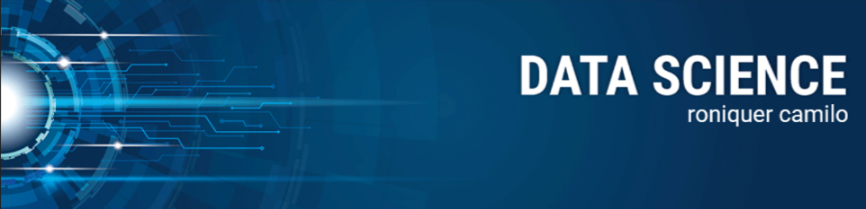

  

# Roniquer Camilo
*Data Scientist* and Electrical Engineer 

As an experienced data scientist and electrical systems operator, I combine analytical skills, teamwork, and attention to detail. With extensive experience in the electricity distribution sector and data science applications, I've developed critical thinking and problem-solving skills.

My credentials include an MBA in Data Science and Analytics from the University of São Paulo (USP), a postgraduate degree in Electrical Power Systems (SEP), and ongoing postgraduate studies in Computer Vision.

**Background in:** Python, Machine Learning, System Operations and Mathematical Optimisation.

**Links:**
* [LinkedIn](https://www.linkedin.com/in/roniquer-camilo-04a63a237/)

## Projetos:
Veja os tutoriais publicados de DSA:

* **Clusterização e Forcasting de Conjuntos Elétricos:** 

---
